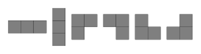
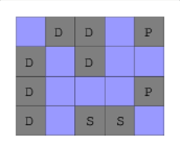
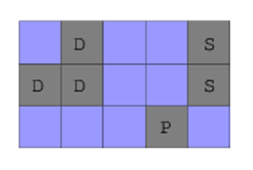
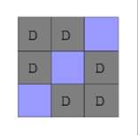
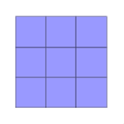

# Task 1

## Problem Description

Battleships is a game played on a rectangular board. You are given a representation of such a board of size N(height) x M(width) with information about the locations of the ships.

The board is given as an array B, whose every element is a string that corresponds to one row of the game board. Each character of each string represents a cell of the board and is either:
- a '#' character, marking a part of a ship; or
- a '.' character, representing an empty cell

Two cells that share a side and have a value of '#' are part of the same ship. Cell (X,Y) shares a side with cells (X,Y-1), (X,Y+1),(X-1,Y) and (X+1,Y).

In the Battleships game there are three types of ships:

Patrol Boats of size 1:


Submarines of size 2, which come in two shapes:


Destroyers of size 3, which come in six shapes:



Your task is to find the number of ships of each type occurring on the board.

For example, on the board represented by B = [".##.#", "#.#..","#...#","#.##."], there are two patrol boats (marked on the image elow as 'P'), one submarine ('S') and two destroyers ('D').




Write a function:
```py
def solution(self, B):
```
that given an array B consisting of N strings of length M each, returns an array R integers, such that:
- R[0] represents the number of Patrol Boats,
- R[1] represents the number of Submarines,
- R[2] represents teh number of Destroyers.

Examples:

1. Given B = ['.##.#','#.#..','#...#','#.##.'], the function should return [2,1,2] as explained above.

2. Given B = ['.#..#','##..#','...#.'], the function should return [1,1,1].



3. Given B = ['##.','#.#','.##'], the function should return [0,0,2].



4. Given B = ['...','...','...'], the function should return [0,0,0]



Assume that:
- N is an integer within the range [1..100];
- all strings in B are of the same length M from the range [1,100];
- every string in B consists only the following characters:'.' and/or '#';
- every ship in the board is either a Patrol Boat (size 1), a Submarine (size 2) or a Destroyer (size 3).

In your solution, focus on correctness. The performance of your solution will not be the focus of the assessment