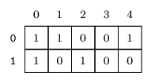
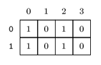

# Task 2

## Problem Description

There is a board with 2 rows and N colums, represented by a matrix M. Rows are numbered from 0 to 1 from top to bottom  and columns are numbered from 0 to N-1 from left to right. Each cell contains either a 0 or a 1. You know that:

- the sum of integers in the 0-th (upper) row is equal to U,
- the sum of integers in the 1-st (lower) row is equal to L,
- the sum of integers in the K-th column is equal to C[K].

Your job is to recover M based on this information.

Write a function:

```py
def solution(U, L, C)
```

that, given two integers U, L and an array C of N integers, as described above, returns a string describing the matrix M in the following format. The first part of the string should be the description of the upper row (N characters: 0 or 1), then there should be comma (,) and finally there should be the description of the lower row (N characters: 0 or 1) The output string should not contain any whitespace.

If there exist multiple valid Ms, your function may return any one of them. If no valid M exists, your function should return the word IMPOSSIBLE.

Examples:

1. Given U=3. L=2, C=[2,1,1,0,1], your function may, for example, return 11001,10100 which describes the following board:




2. Given U=2, L=3, C=[0,0,1,1,2], your function should return the word IMPOSSIBLE, because no matrix M satisfies such conditions.

3. Given U=3. L=2, C=[2,0,2,0], your function may, for example, return 1010,1010 which describes the following board:




Write an efficient algorithm for the following assumptions:

- U and L are integers within the range [0..100,000];
- N is an integer within the range [1..100,000];
- each element of array C is an integer within the range [0..2].